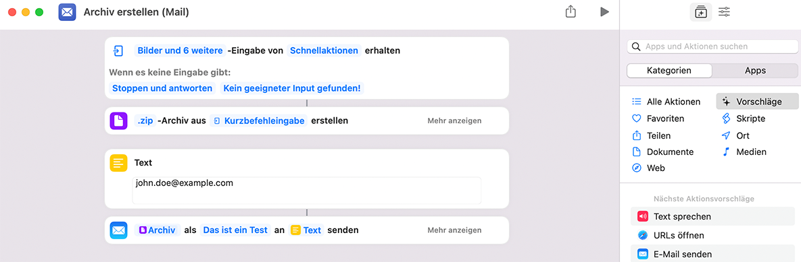
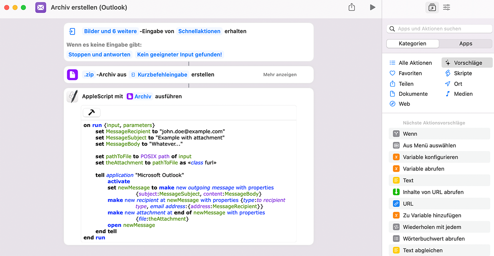
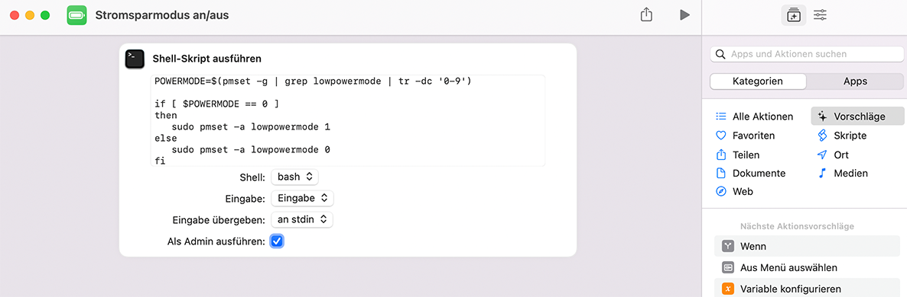

# Apple macOS Kurzbefehle

Dieses Repository dient als Ergänzung zu meinem Artikel über die Kurzbefehle unter Apple macOS Monterey 12, der voraussichtlich in der Ausgabe 4/2022 vom [IT-Administrator](https://it-administrator.de) erscheinen wird. Die folgenden Beispiele wurden unter Apple macOS Monterey 12.1 getestet. Sie stehen zur freien Verfügung und Veränderung zum Download bereit, allerdings ohne Haftung oder Gewähr für korrekte Funktion.

## 1 - Archiv erstellen (Ordner)

Der Kurzbefehl ["1 - Archiv erstellen (Ordner).shortcut"](https://github.com/cknermann/macOS_shortcuts/blob/main/1%20-%20Archiv%20erstellen%20(Ordner).shortcut?raw=true) nimmt Dateien und/oder Ordner aus dem Finder entgegen, verpackt sie in ein Zip-Archiv und speichert es im gewünschten Zielordner.

## 2 - Archiv erstellen (Server)

Der Kurzbefehl ["2 - Archiv erstellen (Server).shortcut"](https://github.com/cknermann/macOS_shortcuts/blob/main/2%20-%20Archiv%20erstellen%20(Server).shortcut?raw=true) nimmt Dateien und/oder Ordner aus dem Finder entgegen, verbindet eine SMB-Freigabe, verpackt die empfangenen Daten in ein Zip-Archiv, speichert es in der Freigabe und trennt diese anschließend wieder.

## 3 - Archiv erstellen (Mail)

Der Kurzbefehl ["3 - Archiv erstellen (Mail).shortcut"](https://github.com/cknermann/macOS_shortcuts/blob/main/3%20-%20Archiv%20erstellen%20(Mail).shortcut?raw=true) nimmt Dateien und/oder Ordner aus dem Finder entgegen, verpackt sie in ein Zip-Archiv und hängt es an eine E-Mail in Apple Mail.

## 4 - Archiv erstellen (Outlook)

Der Kurzbefehl ["4 - Archiv erstellen (Outlook).shortcut"](https://github.com/cknermann/macOS_shortcuts/blob/main/4%20-%20Archiv%20erstellen%20(Outlook).shortcut?raw=true) nimmt Dateien und/oder Ordner aus dem Finder entgegen, verpackt sie in ein Zip-Archiv und hängt es an eine E-Mail in Microsoft Outlook. Dazu kommt das AppleScript aus [Listing 1](https://github.com/cknermann/macOS_shortcuts/blob/main/Listing1.applescript) zum Einsatz.

## 5 - Stromsparmodus

Der Kurzbefehl ["5 - Stromsparmodus.shortcut"](https://github.com/cknermann/macOS_shortcuts/blob/main/5%20-%20Stromsparmodus.shortcut?raw=true) schaltet den Stromsparmodus des Betriebssystems um. Dazu kommt das Shell-Skript aus [Listing 2](https://github.com/cknermann/macOS_shortcuts/blob/main/Listing2.sh) zum Einsatz. Ist der Stromsparmodus inaktiv, schaltet das Skript ihn ein, und umgekehrt.

## 6 - Bilder skalieren

Der Kurzbefehl ["6 - Bilder skalieren.shortcut"](https://github.com/cknermann/macOS_shortcuts/blob/main/6%20-%20Bilder%20skalieren.shortcut?raw=true) nimmt Bilder aus dem Finder entgegen, ändert deren Größe und und speichert die geänderten Bilder im gewünschten Zielordner.